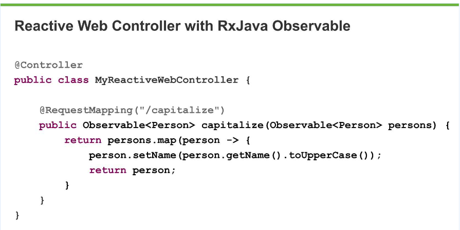

# RxJava by example

* Introduction
* Plain Java
* Spring Boot/Tomcat Example

## Introduction

Why reactive as a subject and my RxJava "background" 

*Buzz sentences on internet scale reactive systems*

* From pull to push - never block
* Async over sync
* Everything is a stream
* Back pressure driven (and perhaps throttling)

### Slow means broken

Think [Hystrix][hystrix timeout link], is has a default timeout of 1.000 ms before it tells clients that the service is down.

### Microservice architecture

Using Microservice architecture means many networks calls. This will lead to wait time and errors.
Going back to "Slow means broken", we should be responsive and not deny service to users just because we are waiting 
and we should handle errors so they don't cascade and take down the whole system (one system is slow, then another becomes slow and so on).

Image from [NGINX][NGINX] Introduction to Microservices.

### Tomcat thread pool 

Many users can connect to a tomcat server. A subset of these will be actively processed by Tomcat (default 200 threads).
 While Tomcat is processing on the 200 threads, the other users are blocked. 
 
Why should user A be blocked while Tomcat is waiting for data from a database, a web service call, etc? 

## Plain Java

How would you write this Java code:

> Call service A and B without blocking your thread.

And how about this:

> Call service A and then B (with result of A) without blocking your thread.

See FuturesA.java and FuturesB.java

## Spring Boot Example

### Service walk-through

*Run Main*

#### Backend

*Code in BackendApplication*

* [http://localhost:9081/service](http://localhost:9081/service) has a 5000 ms delay 
* [http://localhost:9081/service?arg=kim](http://localhost:9081/service?arg=kim) like above but takes argument and prints it and its length
* [http://localhost:9081/fail](http://localhost:9081/fail) returns HTTP code 500 after 500 ms 

#### Frontend

*Code in FrontendApplication and service.MyService*

Make one network call

* [http://localhost:9080/syncOne](http://localhost:9080/syncOne) 
* [http://localhost:9080/asyncOne](http://localhost:9080/asyncOne)

Make two independent network calls, combine and return

* [http://localhost:9080/syncTwo](http://localhost:9080/syncTwo) 
* [http://localhost:9080/asyncTwo](http://localhost:9080/asyncTwo)

Make two network calls, one after the other, note the composability of rx

* [http://localhost:9080/syncSequence](http://localhost:9080/syncSequence) 
* [http://localhost:9080/asyncSequence](http://localhost:9080/asyncSequence) 

Frontend error mechanisms, imagine doing this in standard java code

* Timeout, default value: [http://localhost:9080/timeout](http://localhost:9080/timeout)
* Error, call something else: [http://localhost:9080/exp](http://localhost:9080/exp)

> Punch line: Writing reactive code is simple and with no scheduleOn it runs single threaded. 

### This is the future

Spring MVC 5.0, accept and return reactive streams

### Apache AB tests

How many threads (== requests actually being processed at the same time) is optimal for Tomcat? [https://www.google.dk/search?q=optimal+number+of+tomcat+threads](https://www.google.dk/search?q=optimal+number+of+tomcat+threads)

Note thread count in Main for BackendApplication is 1.  Run main and use [Apache Benchmark](https://httpd.apache.org/docs/2.4/programs/ab.html) or [Apache JMeter](http://jmeter.apache.org/)

`./ab.exe -n 10 -c 5 http://localhost:9080/syncOne` will show something like total time of +25000 ms

`./ab.exe -n 10 -c 5 http://localhost:9080/asyncOne` will show something like total time of +5000 ms

Experiment with different number of threads for BackendApplication Tomcat and sleep time in the service.

[hystrix timeout link]:https://github.com/Netflix/Hystrix/wiki/Configuration#execution.isolation.thread.timeoutInMilliseconds
[NGINX]:https://www.nginx.com/blog/introduction-to-microservices/